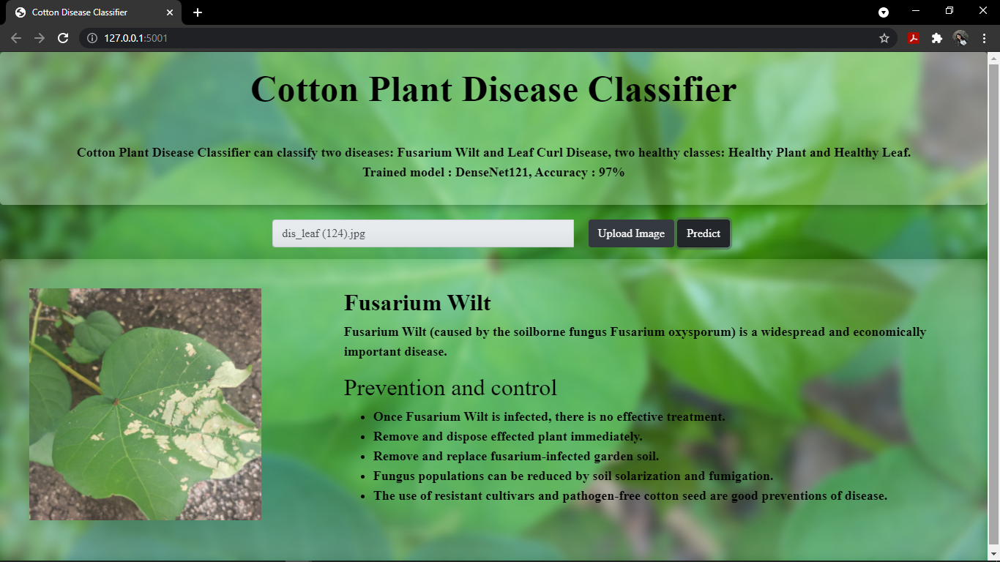

# Cotton Plant Disease Classification Web Application :herb:
This repository is about an end to end implemetation of deep learning cotton plant disease classification web application using flask. 

## Dataset
The dataset is downloaded from [Kaggle](https://www.kaggle.com/janmejaybhoi/cotton-disease-dataset). 

- total size - 152 MB. 
- train      - 1951 images
- validation - 253 images 
- test       - 160 images 

## Classes
- diseased cotton plant (Fusarium Wilt)
- diseased cotton leaf (Leaf Curl Disease)
- fresh cotton plant (Healthy Plant)
- fresh cotton leaf (Healthy Leaf). 

Image resolution - 694x694 pixels \
Image format - JPG format
## sample images of the dataset  


## DenseNet Model
Pretrained DenseNet121 model on ImageNet dataset is used. With the help of transfer learning, the last 8 layers of the model are tuned to solve the problem. The model is trained for 20 epoches and the accuracy is 97% on test data. 


## Training Accuracy and Loss


## Confusion Matrix


## Demo


## Usage

### Install dependencies
```
pip install -r requirements.txt
```

### Training
For model implementation and training, run  
```
densenet121cottondisease.ipynb
```

### Inference

Download model weight -  [DenseNet121.h5](https://github.com/myatmyintzuthin/Cotton-Plant-Disease-Classification-Web-Application/blob/master/DenseNet121.h5) and store inside `/model` folder.

For running Flask app,run:
```
python app.py
```

## Docker
To build docker image, run:
```
docker build -t cotton .
```

To run docker image, run:
```
docker run --name cotton-app -p 80:80 cotton
``` 

To stop docker:
```
docker stop cotton-app
```
## Contributors
- Sakshi ([@GitHub Sakshi053](https://github.com/Sakshi053))
- Prachi Gupta ([@GitHub Prachigupta0305](https://github.com/Prachigupta0305))
